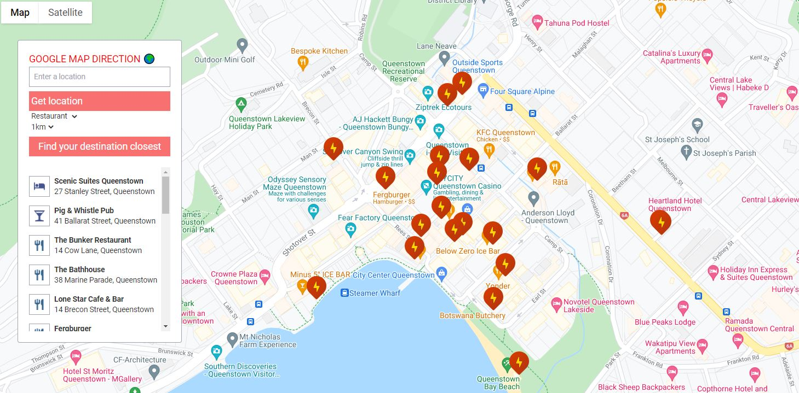

<h1 align="center">GOOGLE MAP DIRECTION 🌍</h1>

<br/>

## Quickstart with Vite 2.x + Vue 3.x + Tailwind 2.x & all common setup

This starter template also includes:
- [Vue Router 4.x](https://github.com/vuejs/vue-router-next)
- [Just-in-Time](https://tailwindcss.com/docs/just-in-time-mode) mode by default introduced in Tailwind CSS v2.1 (in preview!)
First-party plugins needed for Tailwind UI:
- [tailwindcss/forms](https://github.com/tailwindlabs/tailwindcss-forms)
- [tailwindcss/typography](https://github.com/tailwindlabs/tailwindcss-typography)
- [tailwindcss/line-clamp](https://github.com/tailwindlabs/tailwindcss-line-clamp)
- [tailwindcss/aspect-ratio](https://github.com/tailwindlabs/tailwindcss-aspect-ratio)
### Getting Started 🚀
npm:
```sh
npm install
npm run dev
npm run build
npm run serve
```
yarn:
```sh
yarn
yarn dev
yarn build
yarn serve
```

### New features of Vue3 uses ✔

- Use `ref & reactive` (ref for `String, Number, Array, Boolean, Symbol` || reactive for `Object`)
- 


### New features of vite uses ✔

- Please take a look closely to file `vite.config.js`, its contain some feature options good.
```
// Declare the path "@" instead of "/src"
alias: [{find: "@", replacement: path.resolve(__dirname, '/src')}

// Declare the path of variable source to use variable in style tag in components
css: {
  preprocessorOptions: {
    scss: {
      additionalData: `@import "./src/assets/stylesheets/_variables";` 
    } 
  } 
},

// 

```

### Plugin uses  ✔
- `Auto import components` instead of declare in each files: https://github.com/antfu/vite-plugin-components
- `Fetch instead of Axios` https://fetch.spec.whatwg.org/ 
- `Google Maps JavaScript API` & `Google Maps Geocoding API` & `Google Maps Places API` free trail 3 months.
- `Deploy Netlify` & `Virtual bypass CORS: Heroku` https://github.com/Rob--W/cors-anywhere